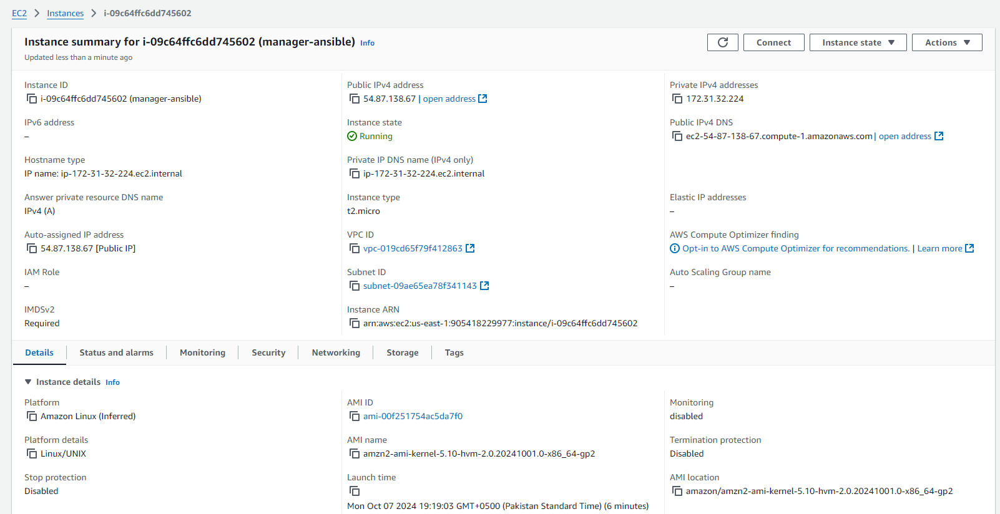
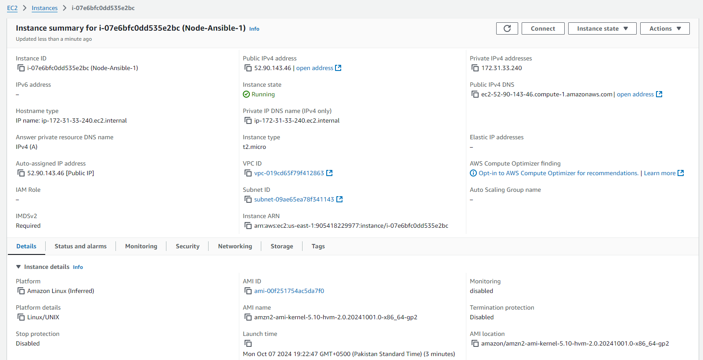
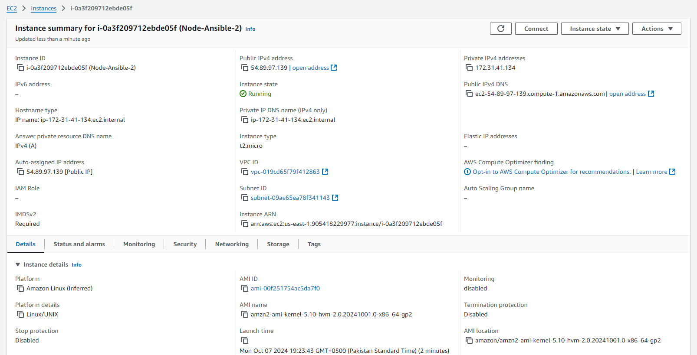
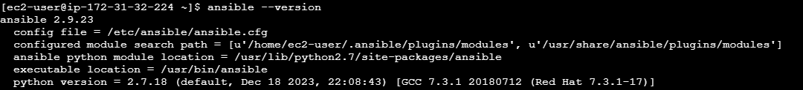
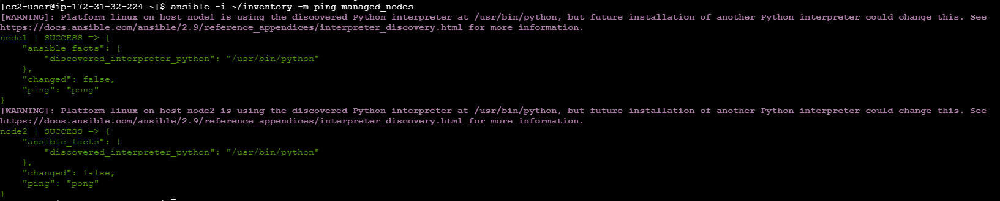
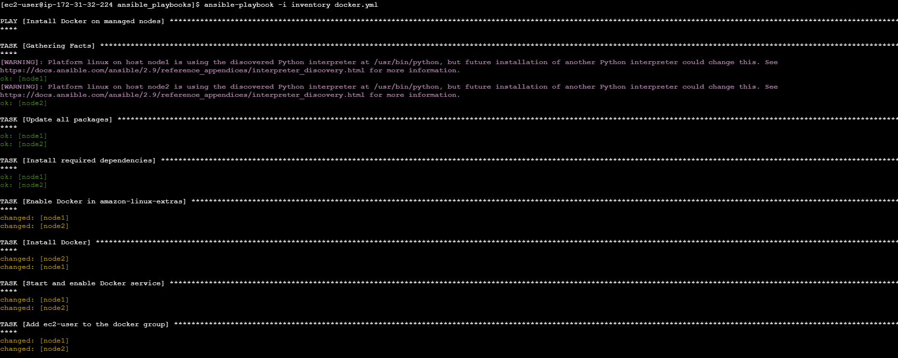
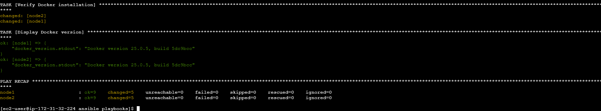
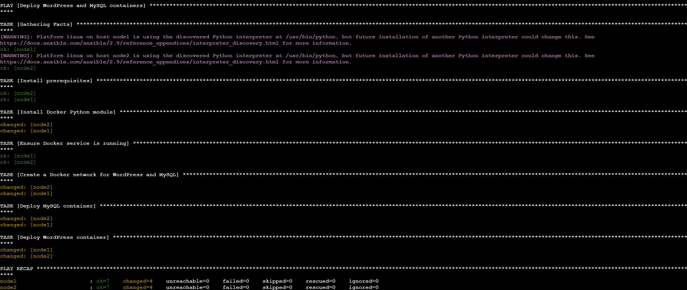
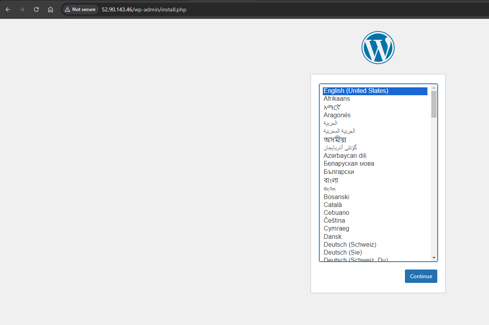
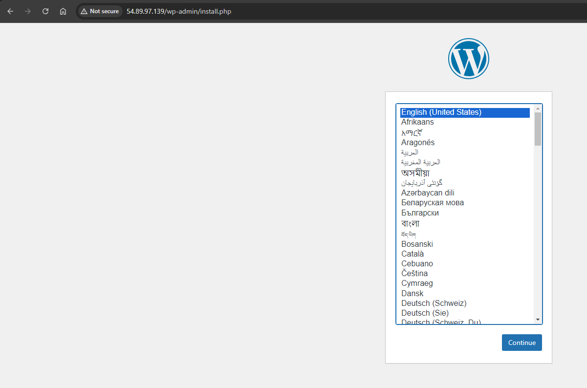

# AWS EC2 WordPress Deployment with Ansible

## 📄 Description
This project demonstrates a scalable and automated setup of WordPress on AWS EC2 instances using Ansible, leveraging Ansible’s automation capabilities to streamline deployment. The project provisions three EC2 instances: one as the **Control Node** (where Ansible is installed) and two **Managed Nodes**. Ansible is configured on the Control Node to manage the other two instances, where Docker is installed, and WordPress is deployed within a Docker container. Additionally, a dynamic inventory setup is configured using AWS EC2’s plugin for Ansible, allowing the project to automatically pull EC2 instance information based on tags, regions, and states.

[](architecture.png)

### Key Objectives

- Provision EC2 instances as the control and managed nodes.
- Install Docker on managed nodes for containerized deployments.
- Deploy WordPress and MySQL as Docker containers on managed nodes.
- Set up dynamic inventory using `aws_ec2.yaml` to automate EC2 instance grouping.

---

## 📂 Project Files Overview

### 1. `docker.yml` - Docker Installation Playbook

The `docker.yml` playbook is responsible for installing Docker on the managed EC2 instances. This playbook performs the following steps:
- **Updates** package indexes on the managed nodes.
- **Installs** prerequisite packages for Docker, including `apt-transport-https`, `ca-certificates`, and `curl`.
- **Adds** Docker's official GPG key and repository to the managed nodes, ensuring access to Docker’s stable releases.
- **Installs Docker** on each managed node.
- **Starts** and **enables Docker**, ensuring it’s available for subsequent container deployments.

### 2. `wordpress.yml` - WordPress and MySQL Deployment Playbook

The `wordpress.yml` playbook is designed to deploy **WordPress** and **MySQL** containers on managed nodes using Docker. Here’s a breakdown of its tasks:
- **Prompts for Database Credentials**: Secure prompts request MySQL root password, WordPress database username, and password for secure deployment.
- **Creates a Docker Network**: Sets up a custom Docker network (`wordpress-net`) to facilitate communication between the WordPress and MySQL containers.
- **Deploys MySQL Container**: Instantiates a MySQL container with specified credentials and database configurations, connected to the `wordpress-net`.
- **Deploys WordPress Container**: Deploys WordPress, configured to connect to the MySQL container on `wordpress-net`, making it accessible over HTTP.

### 3. `aws_ec2.yaml` - Dynamic Inventory Configuration

The `aws_ec2.yaml` file sets up a **dynamic inventory** for the EC2 instances in AWS. By using AWS tags and filtering options, this configuration file groups instances automatically:
- **Filters Instances**: Pulls instances tagged as `Type: Managed` and currently in a `running` state.
- **Groups by Tags**: Organizes instances by tags (`Type` and `Name`) and availability zone for targeted task execution.
- **Assigns Hostnames**: Maps instances to their public IPs, allowing Ansible to manage them dynamically.

---

## 📚 Project Details

### Step 1: Provision EC2 Instances
1. **Control Node**: Acts as the Ansible host, from where we manage and deploy configurations to the managed nodes.
2. **Managed Nodes**: Two EC2 instances where Docker and WordPress will be installed and managed.

   **Note**: Ensure SSH access is correctly configured between the Control Node and Managed Nodes for Ansible communication.

[](file/pic1.png)

[](file/pic2.png)

[](file/pic3.png)

### Step 2: Configure Ansible on Control Node
- **Ansible Installation**: Install Ansible on the Control Node, ensuring it is configured to manage the Managed Nodes.

[](file/pic4.png)

- **Inventory File Setup**: An inventory file lists the IPs of the Managed Nodes, grouping them for Ansible’s management.
- **Disable SSH Key Checking**: Modify the Ansible configuration file to bypass SSH key verification, making the automation process seamless.

### Step 3: Connectivity Test (Ping Test)
1. **Inventory File**: Create an inventory file with the public IP addresses of the Managed Nodes.
2. **Ping Test**: Use Ansible’s ping module to verify connectivity between the Control Node and Managed Nodes.

   ```bash
   ansible -i inventory -m ping managed_nodes
   ```

[](file/pic5.png)

### Step 4: Docker Installation Playbook
- **Objective**: To install Docker on the two Managed Nodes, enabling container deployments.
- **Execution**: The `docker.yml` playbook updates packages, installs Docker dependencies, adds Docker’s GPG key, sets up the stable repository, and ensures Docker is running.

   Run the playbook as follows:

   ```bash
   ansible-playbook -i inventory docker.yml
   ```

[](file/pic6.png)
[](file/pic7.png)


### Step 5: WordPress Deployment Playbook
This playbook `(wordpress.yml)` automates the deployment of WordPress and MySQL containers on the Managed Nodes. The containers are networked together, and the playbook secures sensitive information through Ansible prompts.

**Secure Prompts:** The playbook requests MySQL root password, WordPress database username, and password from the user for security.

**Key Tasks:**

- Create Docker Network: Sets up a dedicated Docker network named wordpress-net for WordPress and MySQL communication.
- MySQL Deployment: Deploys a MySQL container on the network using the provided credentials.
- WordPress Deployment: Sets up the WordPress container linked to the MySQL database and exposes it on port 80.

Execute the playbook as follows:

```bash
ansible-playbook -i inventory wordpress.yml
```

[](file/pic8.png)

**Results**: The Control Nodes Public IP provide the following results

Node 1:

[](file/pic9.png)

Node 2:

[](file/pic10.png)

## Step 6: Dynamic Inventory Setup

To avoid manually managing IP addresses and inventory files, we utilize Ansible’s dynamic inventory feature with AWS. This setup automatically pulls details of the running EC2 instances based on specified filters and tags, streamlining the process of managing cloud-based infrastructure.

1. **Install Boto3**: Ansible requires the Boto3 Python library to communicate with AWS.
   ```bash
   sudo yum install -y python3-boto3
   ```
2. **Install and Configure AWS CLI**: Set up the AWS CLI to provide Ansible with the required credentials to interact with AWS resources.
   ```bash
   aws configure
   ```

   Provide the Access Key, Secret Key, Region, and Output Format during configuration.
3. **Dynamic Inventory Configuration**:

  - Create an `aws_ec2.yaml` file in the Ansible project directory to define the dynamic inventory settings. This file allows Ansible to retrieve all instances with specific tags or properties.
  - Ensure the configuration includes:
    - Plugin: `amazon.aws.aws_ec2`
    - Regions: The AWS region where instances are running.
    - Keyed Groups: A way to organize instances based on tags or other instance attributes.
    
   Example configuration (`aws_ec2.yaml`):
   ```yaml
   plugin: amazon.aws.aws_ec2
regions:
  - us-east-1
filters:
  instance-state-name: running
  "tag:Type": "Managed"
keyed_groups:
  - key: tags
    prefix: tag
```
4. **Test Dynamic Inventory**: Verify that the inventory pulls the correct instances.
   ```bash
   ansible-inventory -i aws_ec2.yaml --graph
   ```

## Step 7: Run Ansible Playbooks with Dynamic Inventory

With the dynamic inventory setup, you can now run the playbooks without manually updating the inventory file.

1. **Run Docker Installation Playbook**:
   ```bash
   ansible-playbook -i aws_ec2.yaml docker.yml
   ```
   
2. **Run WordPress and MySQL Deployment Playbook**:
   ```bash
   ansible-playbook -i aws_ec2.yaml wordpress.yml
   ```

These commands will automatically pull the list of running EC2 instances matching the specified criteria in `aws_ec2.yaml` and run the tasks defined in each playbook.

## ✅ Conclusion

This project showcases the automation capabilities of Ansible in managing cloud-based infrastructure and deploying applications. By leveraging AWS dynamic inventory, we achieved a seamless integration between Ansible and AWS, enabling efficient management of EC2 instances without the need for static inventory files. This approach enhances scalability, adaptability, and ease of maintenance, making it ideal for dynamic cloud environments. Using Ansible to automate Docker and WordPress deployments demonstrates a streamlined workflow for consistent, reliable application deployment across cloud platforms.
